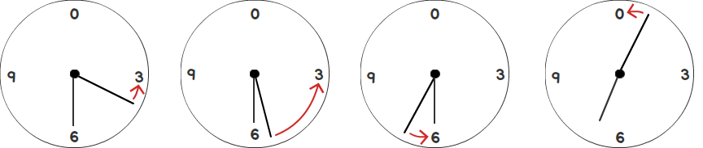

# Design

Utapi tracks metrics of a service's usage. Metrics provided by Utapi include the
number of incoming and outgoing bytes, the number of objects being stored, the
storage utilized in bytes, and a count of operations performed on a service's
resources. Operations supported by Utapi include APIs offered by Scality's [S3
Server](https://github.com/scality/S3). Metrics can be retrieved for a given
time range in a service's history.

## Time Range

Utapi offers metrics for a time range provided by the user. For example, Utapi
allows a user to view all actions that have occurred over the course of a
particular month, week, or day. Time ranges are customizable up to a precision
of fifteen minutes.

Note: A time range precision of less than fifteen minutes can be supported as a
feature request and could be set as a configurable option.

### Timestamps

Metrics provided by Utapi are set to the latest fifteen minute interval (i.e.,
00:00:00, 00:15:00, 00:30:00, or 00:45:00). For example, if a user creates a
bucket at 06:15:01, the operation will have a timestamp of 06:15:00. All
timestamps are then formatted as a UNIX epoch expressed in milliseconds. During
a listing of metrics, then, we can know that this operation occurred sometime
between 06:15:00 and 06:29:59.

#### Example

| current time | timestamp | UNIX epoch timestamp |
|--------------|-----------|----------------------|
| 06:15:01     | 06:15:00  | 1483280100000        |
| 06:29:59     | 06:15:00  | 1483280100000        |
| 06:31:00     | 06:30:00  | 1483281000000        |
| 07:01:00     | 07:00:00  | 1483282800000        |



### Data Storage

Utapi uses Redis as a database for storage of its metrics values. Accordingly,
it uses three different Redis data types: Sorted Sets, Strings, and Lists. This
document describes how these three data types are used by Utapi. For further
information on data types see the Redis
[documentation](https://redis.io/topics/data-types).

#### Sorted Sets

The Redis keys storing metrics for the number of objects and the storage
utilized are recorded with a Sorted Set data type. We use this data type to
associate the value of the key with its timestamp (in Redis terminology, a
score). In this way, these two metrics hold *stateful* data. That is, the key's
value represents the state of a metric at that point in history.

With a Sorted Set, then, we can create a list of values ordered by their
timestamp. This ordered nature is especially useful for Utapi during a listing
of metrics, as it allows for speedy retrieval of the nearest starting and ending
values.

#### Strings

The Redis keys storing metrics for incoming bytes, outgoing bytes, and all S3
operations (e.g., 'CreateBucket', 'PutObject', etc.) are recorded with a String
data type.

Moreover, there are also global counters associated with metrics for the number
of objects and the storage utilized. Such counters are updated during any
applicable operation. For example, when uploading or deleting an object, the
counter for the number of objects increments or decrements, respectively. These
counters are used internally by Sorted Sets to record the state (the storage
used and the number of objects) at a particular point in time.

#### Lists

Redis keys storing cached metrics use a List data type, where each List element
is a string containing information from the original request. This datatype is
used by a component named UtapiReplay that pushes any metrics stored in the List
every five minutes, by default.

#### Example

Steps occurring during a successful 'PutObject' request:

1. If the new object overwrites a pre-existing object, the counter for the
    number of objects remains unchanged. Otherwise it increments by one.

2. If the new object overwrites a pre-existing object, the counter for the
    storage utilized increments by the difference between the byte size of the
    object and byte size of the object being overwritten. Otherwise, it
    increments by the byte size of the new object.

3. The metric for the incoming bytes increments by the byte size of the new
    object.

4. The metric for the 'PutObject' operation increments by one.

5. The Sorted Set keys (the storage used and the number of objects) are updated
    to the value of their respective counter.

If a connection to the Redis datastore cannot be made, metrics from the original
request to Utapi are pushed to a local Redis cache to be retried at a later
time.

### Schema Keyspace

The key created for each metric expresses a hierarchy of the data stored by that
key. It expresses the service, resource type, the resource, and the metric value
being stored by the key. These levels are divided by a colon.

```
<service>:<resourcetype>:<resource>:<metric>
```

`<service>` The service that the metric belongs to (for example, 's3').

`<resourcetype>` The type of resource being accessed (for example, 'buckets'
or 'accounts').

`<resource>` The bucket name or account ID (for example, 'foo-bucket').

`<metric>` The metric to get values for (for example, 'storageUtilized').

Thus, a key storing the storage utilized by 'foo-bucket' in 's3' would be:

```
s3:buckets:foo-bucket:storageUtilized
```

#### Timestamped Keys

Metrics for S3 operations create keys that generally follow the same pattern as
above. However, they also include the timestamp at which the operation occurred.
For example, the key storing the count of 'PutObject' operations `foo-bucket` on
January 01 2016 00:01:00 (where `1451635200000` is the UNIX epoch timestamp of
the operation):

```
s3:buckets:1451635200000:foo-bucket:PutObject
```

#### Local Redis Cache Key

Metrics of operations pushed by S3 that are unsuccessfully recorded as schema
keys in the Redis datastore (for example, in the case of a failed connection)
are stored in a local Redis cache. For example, the key storing cached metrics
of S3 operations:

```
s3:utapireplay
```

The value of the the local Redis cache key is list of JSON strings, where each
string contains the parameters and timestamp of an unsuccessful `pushMetric`
call. For example, a string storing metrics for a 'PutObject' operation:

```
"{\"action\":\"putObject\",\"reqUid\":\"3d534b1511e5630e68f0\",\"params\":{\"bucket\":\"foo-bucket\",\"newByteLength\":1024,\"oldByteLength\":null},\"timestamp\":1451635200000}"
```

### redis-cli

Note: Using blocking calls (for example, `KEYS *`) with a Redis client during
production will temporarily block other calls to the Redis Server by Utapi.

Access the storage utilized for the latest fifteen minute time interval using
the command line interface of Redis, `redis-cli` (see Redis
[documentation](https://redis.io/topics/rediscli)):

```
ZRANGE s3:buckets:foo-bucket:storageUtilized -1 -1 WITHSCORES
```

The `WITHSCORES` option in the above command will return the timestamp for each
value.

Access the value stored by a key that is a String data type:

```
GET s3:buckets:1451635200000:foo-bucket:PutObject
```
